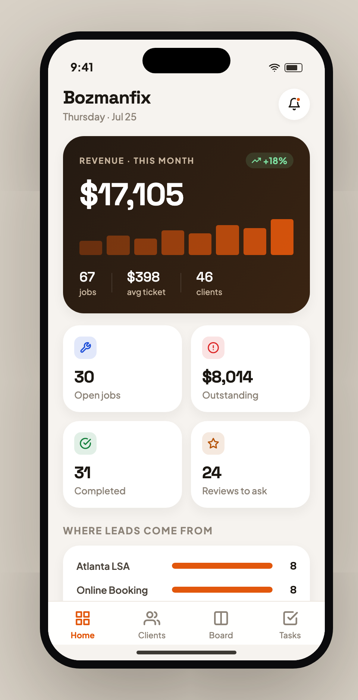
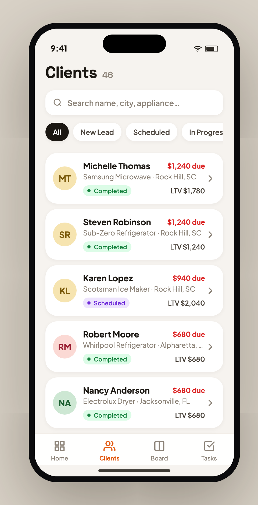
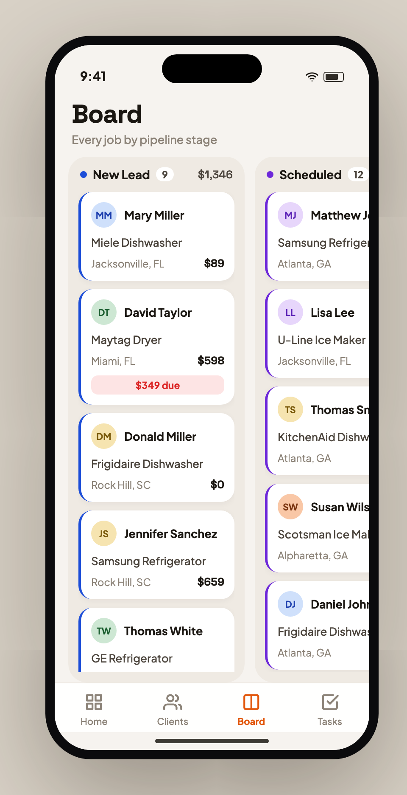
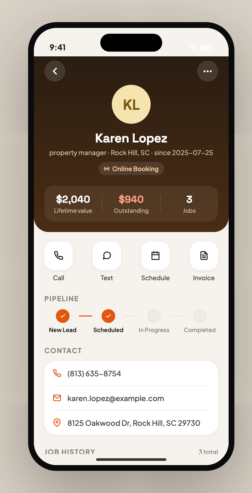

# Mobile Portfolio — Igor Odaryuk

Mobile apps built from **real operational pain**, not toy demos. Each one starts from a
problem seen in a live business (field service, local SEO, lead ops) and is built to
production-grade UI quality.

## Apps

### 🚀 Client Hub — [`/client-hub`](./client-hub)
Phone-first CRM for home-service businesses on Housecall Pro / Jobber. Client 360,
pipeline board, and auto-generated follow-up tasks in one place.
**React Native · Expo · TypeScript.**

  
  
  
  

## On deck

Candidates drawn from real client problems, in build order:

1. **Owner Cockpit** — revenue / leads / "where I'm losing bookings", RN dashboard.
2. **Callback Conveyor** — push reminders to call back stalled leads (working backend).
3. **Honest Falcon Maps** — geo-grid map of local Google Maps ranking.

---
*Each app ships with synthetic demo data and a real, runnable codebase.*
