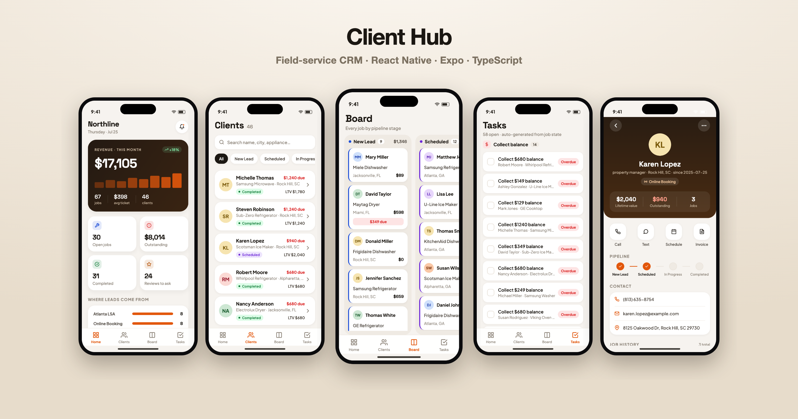

# Client Hub — field-service CRM (mobile)

A phone-first CRM for home-service businesses (appliance repair, HVAC, cleaning) that
run on Housecall Pro / Jobber. It puts the whole client 360 — jobs, money, pipeline
stage and follow-up tasks — on one screen, so the owner and dispatchers stop digging
through a dozen chat threads to answer "who owes what, and who do we call next?"

Built as a **React Native + Expo + TypeScript** app. This repo is the UI layer of the
product; it ships with a fully **synthetic** demo dataset so it runs with zero backend.



## Screens

| | |
|---|---|
| **Home** — revenue, open jobs, outstanding balance, lead sources, "needs attention" | `screenshots/01-home.png` |
| **Clients** — searchable, filterable list with stage, LTV and balance due | `screenshots/02-clients.png` |
| **Board** — kanban of every client by pipeline stage | `screenshots/03-board.png` |
| **Tasks** — follow-ups auto-generated from job state (collect balance, ask for review, schedule, win-back) | `screenshots/04-tasks.png` |
| **Client 360** — one client: money, pipeline stepper, contact, full job history | `screenshots/05-client-detail.png` |

## Stack

- **React Native 0.81 / Expo SDK 57 / React 19 / TypeScript**
- `expo-linear-gradient`, `react-native-svg`, `@expo/vector-icons`
- Type pairing: **Space Grotesk** (display / figures) + **Plus Jakarta Sans** (body)
- Runs on iOS, Android and web from one codebase

## Run it

```bash
npm install
npm run web       # or: npm run ios / npm run android
```

On web the app renders inside an iPhone frame (faux status bar + dynamic island) so it
screenshots cleanly for a portfolio. `?tab=Home|Clients|Board|Tasks` and `?client=<id>`
set the initial screen for deterministic captures.

## Data

The demo dataset is **100% synthetic** — generated by `scripts/gen_seed.py` with
realistic distributions (geography, lead source, appliance brands, job statuses, money)
that mirror the *shape* of a real Housecall Pro export. **No real customer data is used,
read, or committed.** Regenerate with:

```bash
python3 scripts/gen_seed.py    # writes src/data/seed.json
```

## Roadmap

- [ ] Live Housecall Pro / Jobber sync (read jobs, write tasks)
- [ ] Auth + multi-tenant (one install, many businesses)
- [ ] Push notifications for callback / balance-due follow-ups
- [ ] Native builds via Expo → App Store / Play

## License

MIT
