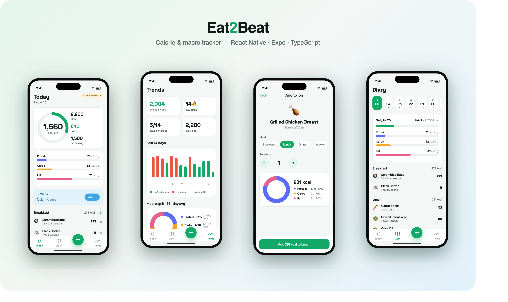

# Eat2Beat — calorie & macro tracker (mobile)

[](https://github.com/IgorOdaryuk/mobile-portfolio/actions/workflows/ci.yml)


**▶ [Live demo](https://igorodaryuk.github.io/mobile-portfolio/eat2beat/)** — the app running in your browser (Expo web build).

A phone-first food diary: log what you eat, watch calories and macros against a daily
goal, and see the week trend. The daily **calorie ring** turns coral the moment you go
over budget; every food carries protein / carbs / fat, so the macro split is derived,
never typed in twice.

Built as a **React Native + Expo + TypeScript** app. It ships with a fully **synthetic**
14-day food log so it runs with zero backend, and everything you log persists locally
(AsyncStorage) across reloads.



## Screens

| | |
|---|---|
| **Today** — calorie ring, macro bars, water, and meals (breakfast → snacks) | `screenshots/01-today.png` |
| **Add Food** — search the food DB, pick a meal + servings, live nutrition preview | `screenshots/02-add.png` |
| **Diary** — 14-day date strip; any day's totals, macros and meal breakdown | `screenshots/03-diary.png` |
| **Trends** — 14-day calorie bars vs goal, streak, days-on-target, macro donut | `screenshots/04-trends.png` |
| **Food detail** — per-serving nutrition facts and macro split for any food | `screenshots/05-food.png` |

## Interactive, not a mockup

- **Add food end-to-end** — search → choose meal → servings stepper → *Add* writes a real
  entry; the Today ring, macros and meal subtotals update immediately.
- **Persists** — logged entries and water survive a reload (AsyncStorage-backed store).
- **Remove / log water** — swipe-free × on any entry; `+1 cup` water button.
- **Live charts** — calorie ring, macro bars, weekly bars and the macro donut are all
  `react-native-svg`, driven from the entry list (no static images).

## Stack

- **React Native 0.86 / Expo SDK 57 / React 19 / TypeScript (strict)**
- `react-native-svg` for the ring / bars / donut, `@expo/vector-icons`
- Type pairing: **Space Grotesk** (display / figures) + **Plus Jakarta Sans** (body)
- Runs on iOS, Android and web from one codebase

## Structure

```
src/
  theme.ts        design tokens (palette, macro hues, radius/space, type)
  types.ts        Food / Entry / Goals / Macros
  selectors.ts    pure data logic (day totals, macro split, streak, series) — unit-tested
  dateutil.ts     pure ISO-date formatting (no clock reads)
  store.tsx       AsyncStorage-backed store (add/remove entry, water)
  ui.tsx          shared primitives (Card, SectionTitle, SampleBadge, Chip)
  components/     charts.tsx (SVG) · FoodRow.tsx
  screens/        Today · AddFood · Diary · Trends · FoodDetail
  data/seed.json  synthetic 14-day log (built by scripts/gen_seed.py)
  __tests__/      jest tests for selectors + seed integrity
App.tsx           font loading, tab navigation, iPhone web frame
```

Data logic lives in `selectors.ts`, decoupled from components, so it stays testable and
screens stay presentational.

## Run it

```bash
npm install
npm run web        # or: npm run ios / npm run android
npm run typecheck  # tsc --noEmit (strict)
npm test           # jest — selectors + seed integrity
```

On web the app renders inside an iPhone frame (faux status bar + dynamic island) so it
screenshots cleanly. URL params set the initial screen for deterministic captures:
`?tab=Today|Diary|Trends`, `?food=<id>`, `?modal=add&meal=lunch&addfood=<id>`.

## Data

The demo log is **100% synthetic** — generated by `scripts/gen_seed.py` with a fixed RNG
seed, so output is deterministic (tests assert on exact numbers). The demo user
("Alex Rivera") and every entry are fictional. **No real health data is used.** Regenerate:

```bash
python3 scripts/gen_seed.py    # writes src/data/seed.json
```

## Roadmap

- [ ] Barcode scan → food lookup (Open Food Facts)
- [ ] Custom foods & recipes, editable goals
- [ ] Weight log + trend, HealthKit / Google Fit sync
- [ ] Native builds via Expo → App Store / Play
- [ ] SwiftUI port (planned once native tooling is set up) — this RN version is the design reference

## License

MIT
