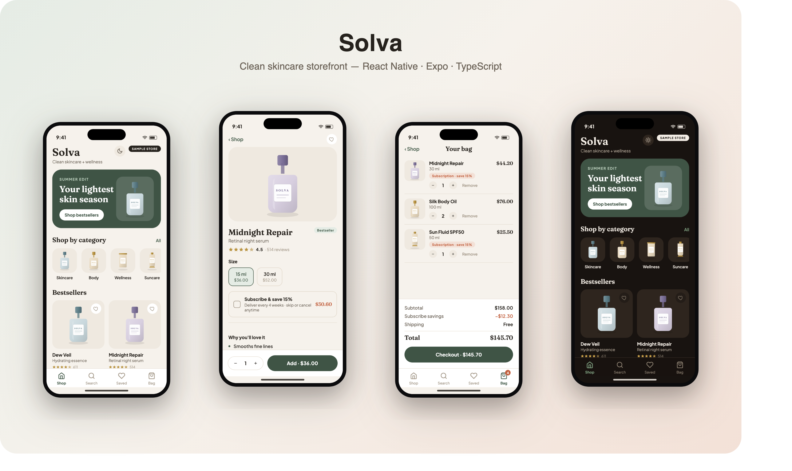
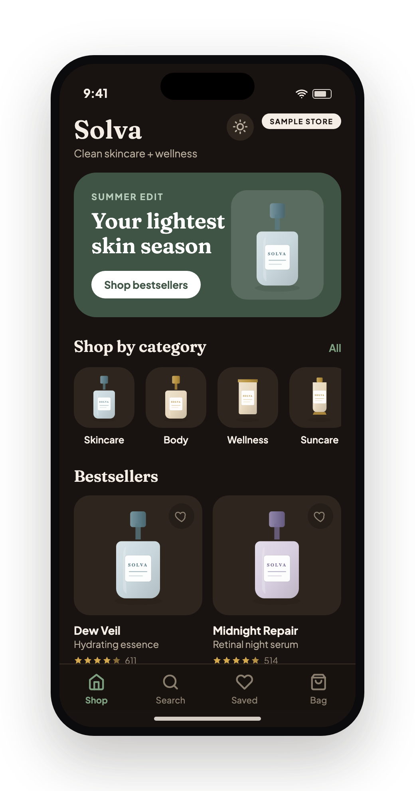

# Solva — clean skincare storefront (mobile)

[](https://github.com/IgorOdaryuk/mobile-portfolio/actions/workflows/ci.yml)


**▶ [Live demo](https://igorodaryuk.github.io/mobile-portfolio/storefront/)** — the app running in your browser (Expo web build).

A premium DTC skincare/wellness storefront: browse by category, open a product,
pick a size, opt into **subscribe-and-save**, and run a full **cart → checkout**
flow. The whole catalog is drawn with **inline SVG product illustrations** (no stock
photos), so it stays crisp and cohesive at any size.

Built as a **React Native + Expo + TypeScript** app with a fully **synthetic** catalog,
so it runs with zero backend. Cart and saved items persist locally (AsyncStorage).



## Screens

| | |
|---|---|
| **Shop** — brand hero, category rail, bestseller grid with ratings + wishlist | `screenshots/01-shop.png` |
| **Product** — SVG gallery, size variants, subscribe-and-save, benefits, reviews | `screenshots/02-product.png` |
| **Category** — search + category filter + sort (featured / rating / price) | `screenshots/03-category.png` |
| **Cart** — qty steppers, subscription lines, live subtotal / savings / total | `screenshots/04-cart.png` |
| **Checkout** — shipping form, delivery options, order summary, order-placed state | `screenshots/05-checkout.png` |
| **Saved** — wishlist grid (empty-state aware) | `screenshots/06-saved.png` |

## Commerce logic that recruiters look for

- **Variants + pricing** — each product has size variants; the selected variant drives
  the price everywhere (detail, cart, checkout).
- **Subscribe-and-save** — a real discount model (15% off) applied per line; the cart
  separates subtotal, savings and total, and flags subscription orders at checkout.
- **Cart state** — add / merge / qty / remove, a tab badge, and **AsyncStorage**
  persistence across reloads.
- **Filter + sort + search** over the catalog; wishlist toggle from any product.
- All of the above lives in **pure functions** (`src/selectors.ts`) and is unit-tested.

## Design identity

Solva has its **own** look, deliberately distinct from the other portfolio apps: an
editorial beauty-brand feel built on a **Fraunces serif** display face (not the grotesk
used elsewhere), a warm cream palette, and a full **light / dark theme** — the dark mode is
a warm "espresso" brown, not flat grey. Toggle it from the moon/sun in the Shop header
(persisted to AsyncStorage; force with `?theme=dark` for screenshots).



## Stack

- **React Native 0.86 / Expo SDK 57 / React 19 / TypeScript (strict)**
- `react-native-svg` for product illustrations, ratings stars and icons
- Runtime **theming** via a light/dark palette + `useStyles(makeStyles)` context
- Type pairing: **Fraunces** (serif display) + **Plus Jakarta Sans** (body)
- Runs on iOS, Android and web from one codebase

## Structure

```
src/
  theme.ts        design tokens (warm palette, product tints, subscribe rate)
  types.ts        Product / Variant / Review / CartLine / Category
  selectors.ts    pure commerce logic (cart, subscribe, filter/sort, ratings) — tested
  store.tsx       AsyncStorage-backed cart + wishlist store
  ui.tsx          Stars, Tag, SampleBadge, HeartButton, Card
  components/     ProductArt.tsx (SVG vessels) · ProductCard.tsx
  screens/        Shop · Category · ProductDetail · Cart · Checkout · Wishlist
  data/seed.json  synthetic catalog (built by scripts/gen_catalog.py)
  __tests__/      jest tests for selectors + catalog integrity
App.tsx           fonts, tab navigation + cart badge, iPhone web frame
```

## Run it

```bash
npm install
npm run web        # or: npm run ios / npm run android
npm run typecheck  # tsc --noEmit (strict)
npm test           # jest — selectors + catalog integrity
```

On web the app renders inside an iPhone frame for clean portfolio screenshots. URL params
drive deterministic captures: `?tab=Shop|Search|Saved|Bag`, `?product=<id>`,
`?checkout=1`, and `?seedcart=1` / `?seedwish=1` to pre-fill a demo bag / wishlist.

## Product imagery

Products render as layered **SVG mockups** (glass-gradient body, specular highlight,
printed SOLVA label, soft shadow) — cohesive and asset-free. To swap in **real / AI
photography**, drop PNGs into `assets/products/` and map them by id in
`src/data/productImages.ts`; the app renders the photo wherever the product appears and
falls back to the SVG for any unmapped id. No other code changes.

Prompt for a cohesive AI-generated set (one per product, same look):

> *Studio product photograph of a [dropper serum bottle / frosted glass jar / squeeze
> tube / matte pouch] for a premium clean-skincare brand, [tint] colored packaging,
> minimalist white label, centered on a seamless warm-cream (#F6F2EC) background, soft
> diffused daylight from the left, gentle shadow, 1:1, high detail, no text.*

Keep background, framing and lighting identical across all 17 so the grid reads as one shelf.

## Data

The catalog is **100% synthetic** — generated by `scripts/gen_catalog.py` with a fixed RNG
seed (deterministic; tests assert on it). **Solva** is a fictional brand and every product,
price and review is invented. **No real brand or customer data.** Regenerate:

```bash
python3 scripts/gen_catalog.py    # writes src/data/seed.json
```

## Roadmap

- [ ] Real checkout (Stripe) + order history
- [ ] Product image photography slot (swap the SVG art for real shots)
- [ ] Accounts, addresses, saved payment
- [ ] Manage-subscription screen (skip / swap / cancel)
- [ ] Native builds via Expo → App Store / Play

## License

MIT
